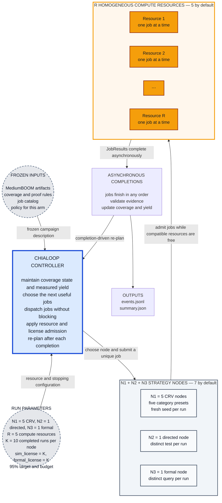

# Chialoop ROI Demonstration Plan

This is the current protocol for new campaigns. Historical frozen campaigns
and their measured results retain their original configuration and policy;
this revision does not retroactively change their experimental claims.

## 1. Claim to test

The first demonstration should test one claim:

> Given the same verification jobs and the same limited resources, an adaptive
> Chialoop reaches 95% sound coverage closure with fewer compute-hours than a
> fixed hybrid schedule.

The Chialoop does this by observing the measured yield of CRV, directed, and
formal work and reallocating the next available compute slot to the work with
the highest recent coverage gain per compute-hour.

This is stronger than comparing against simulation alone. The primary baseline
also has CRV, directed tests, formal, CHIA execution, and license-aware
admission. The only intended difference is the allocation policy.

The first experiment does **not** try to prove cache, worker-locality,
multi-configuration, stimulus-generation, fault-recovery, and wall-clock ROI at
the same time. Those are separate experiments in the appendices.

---

## 2. Minimal Experiment

### 2.1 Fixed scope

Use:

- one frozen MediumBOOM configuration;
- one frozen coverage model;
- a frozen coverage-point registry with partitions for reporting;
- N1 CRV nodes, N2 directed nodes, and N3 formal nodes;
- three kinds of verification work: CRV, directed, and formal;
- a target of 95% sound closure;
- a fixed compute-hour budget if an arm does not reach 95%.

A **node** is a repeatable verification strategy, not a physical machine or a
coverage partition. A **job** is one unique run of that node. Defaults are
N1=5, N2=1, and N3=1: seven logical nodes competing for R=5 compute resources.

The five default CRV nodes use these frozen categories:

1. `crv-1`: Integer and control flow.
2. `crv-2`: Load/store and memory ordering.
3. `crv-3`: Multiply, divide, and atomics.
4. `crv-4`: Privilege and exception behavior.
5. `crv-5`: Mixed long-running system behavior.

The other default nodes are `directed-1` and `formal-1`. Each may contain jobs
covering multiple partitions. A partition identifies where coverage belongs;
it does not define a scheduler lane or impose a concurrency limit. All newly
closed, declared target points count, including points in other partitions.
Input preparation must supply the actual category-specific stimulus; assigning
a node ID alone does not change a test's behavior.

### 2.2 Frozen job catalog

Create the candidate job catalog before running either arm.

- **CRV:** pre-generated seeds using one frozen, target-specific preset per
  CRV node. Every run uses a fresh seed. The loop may select among the presets
  but may not modify their knobs during this experiment.
- **Directed:** pre-authored tests mapped to specific open-point groups. Test
  generation is outside the measured campaign.
- **Formal:** pre-authored cover or unreachability queries with frozen
  assumptions, bounds, solver options, and timeouts.

Every job has a stable job ID, a `node_id`, and a `seed_or_query_id`. Both arms
receive identical node assignments and the same finite catalog of prepared
jobs, avoiding better seeds or properties for one arm.

Every dispatch consumes a distinct job: CRV seeds, directed-test identities,
and formal-query identities must be unique within their engine across nodes.
Known simulation input hashes and ELF paths must not be recycled under new
identities. The executor/input preparer must honor those identities with truly
distinct work; renaming a job is not sufficient. Completed jobs are never
rerun, and jobs already in flight cannot be dispatched again. Multiple distinct
runs of the **same node may execute concurrently**.

Execution adapters may provide `execution_fingerprint(job)` to identify the
actual inputs/options independently of labels. Admission rejects duplicate
fingerprints; without a hook it can only check conservative catalog metadata.
The native formal adapter fingerprints and executes the same declared SBY file
and optional task. Changing a job ID or required reporting goal does not create
a distinct solver run. Unsupported execution options fail before dispatch.

Prepare enough unique jobs before the campaign. The core controller does not
synthesize new seeds, tests, or formal queries when the catalog runs out.

### 2.3 Sound closure

Every registered coverage point is in exactly one state:

- `hit`: observed in simulation or reached by a formal cover query;
- `proven_unreachable`: proved unreachable by a complete formal result under
  the registered assumptions;
- `open`: not yet soundly closed.

```text
sound_closure = (hit + proven_unreachable) / registered_points
```

A timeout, bounded non-reach, solver `unknown`, tool failure, or incomplete
proof leaves a point `open`. A result that conflicts with existing coverage or
uses a different assumption version is rejected and logged.

### 2.4 Deliberate simplifications

The core run uses these restrictions so its result is attributable and its code
is small:

- The DUT and formal harness are built before measurement.
- Both arms start from the same artifacts and an empty result cache.
- Directed tests already exist; there is no LLM or artifact-writer node.
- CRV knobs do not change during a run.
- All compute slots have the same CPU, memory, OS, tools, and container image.
- License availability is controlled entirely by this experiment.
- The planner is a frozen deterministic heuristic, not an LLM.
- Worker locality and cross-run result reuse are not scored.

---

## 3. Chialoop configuration

### 3.1 Resources

Configure node counts, compute resources, and the history window before the run:

| Parameter | Default | Meaning |
| --- | ---: | --- |
| N1 (`n1`) | 5 | CRV strategy nodes, one for each category above. |
| N2 (`n2`) | 1 | Directed strategy nodes. |
| N3 (`n3`) | 1 | Formal strategy nodes. |
| R (`resources.compute`) | 5 | Interchangeable execution slots in a homogeneous pool. |
| K (`recent_window`) | 10 | Last K completed runs of each node used to estimate yield. |
| `sim_license` | K | Shared simulation tokens for CRV and directed jobs. |
| `formal_license` | K | Formal tokens. |

Unspecified license counts each resolve to K, including when K is overridden
before launching. Explicit license settings take precedence. Thus the default
pool has `compute:5`, `sim_license:10`, and `formal_license:10`; compute capacity
limits simultaneous jobs to five. Licenses are admission tokens, not extra
compute resources or an assertion about purchased tool seats.

Use campaign JSON fields or CLI overrides `--n1`, `--n2`, `--n3`, `--r` (alias
`--resources`), `--k`, `--sim-licenses`, and `--formal-licenses`. Freeze the
resolved settings identically for both arms. Counts below five select the first
N1 default CRV categories; extra CRV nodes need user-prepared strategies. A node
without pending jobs cannot be dispatched. Missing `node_id` is allowed only
when its engine has one configured node; never infer categories from partition
names.

These capacities are schedulable resource tokens, not physical node counts.
One logical homogeneous worker pool may advertise all three capacities.

Every engine job consumes one identical compute slot:

| Engine function | CHIA resource request | Work performed |
| --- | --- | --- |
| `run_crv` | `compute:1`, `sim_license:1` | Run one frozen CRV seed and return coverage evidence. |
| `run_directed` | `compute:1`, `sim_license:1` | Run one pre-authored directed test and return coverage evidence. |
| `run_formal` | `compute:1`, `formal_license:1` | Run one frozen formal query and return its proof status and evidence. |

The intended CHIA mapping is direct:

```python
@ChiaFunction(resources={"compute": 1, "sim_license": 1})
def run_crv(job: JobSpec) -> JobResult: ...

@ChiaFunction(resources={"compute": 1, "sim_license": 1})
def run_directed(job: JobSpec) -> JobResult: ...

@ChiaFunction(resources={"compute": 1, "formal_license": 1})
def run_formal(job: JobSpec) -> JobResult: ...
```

The corresponding logical worker pool advertises total resources
`{"compute": 5, "sim_license": 10, "formal_license": 10}` by default.
The seven logical strategy nodes invoke these three engine function definitions.
The controller reserves conceptual slots; CHIA performs physical placement.

The driver owns the authoritative coverage state and yield table. Their updates
are serialized in the driver; they do not need separate cluster resources in
this minimal implementation.

A job is dispatched only when all of its requested resources are available.
Therefore a compute slot is never occupied by a tool merely waiting for a
license.

For this homogeneous pool:

```text
compute-hours = sum of the wall-clock run time of every occupied compute slot
```

If a slot represents multiple fixed CPU cores, multiply both arms by that same
core count when reporting CPU-hours.

### 3.2 Chialoop block diagram

This diagram shows one campaign arm. Static-Hybrid uses the same path but
replaces the adaptive choice rule with its frozen manifest.



- The large controller is the active loop. Both gray dotted circles provide one
  grouped input to it.
- The strategy container holds seven logical nodes by default. Three engine
  functions execute their unique jobs. K means history-window length only.
- More logical nodes than resources is expected. Multiple distinct jobs of the
  same node may occupy different resources concurrently.
- The orange blocks represent R execution slots, with R=5 by default; the
  ellipsis does not imply additional capacity.
- Dispatch is non-blocking. Jobs overlap, complete in any order, and return
  independently for validation and completion-driven replanning.

The control loop is:

```text
observe coverage and free resources
    -> choose the best eligible job
    -> dispatch it through CHIA
    -> repeat selection until no pending job fits free resources
    -> wait for the first completion
    -> validate and merge its evidence
    -> release resources and update that node's measured yield
    -> choose again
```

The driver must keep all R slots occupied when useful compatible work exists
and the target/budget permits. There is no one-in-flight-per-node or per-lane
restriction. After processing completions, refill free resources without waiting
for the other running jobs to finish. The driver must wait for the **first** completion among running jobs, not dispatch one job
and immediately block on only that job.

---

## 4. Implementation contract

### 4.1 Required records

`JobSpec` should contain at least:

```text
job_id
engine                 # crv | directed | formal
node_id                # strategy identity, e.g. crv-2; independent of partition
partition_id
sequence_in_lane       # retained catalog ordering field, not a concurrency limit
target_point_ids
seed_or_query_id       # unique within the engine across nodes
timeout_seconds
artifact_version
assumption_version     # required for formal
resource_request
```

`JobResult` should contain at least:

```text
job_id
status                 # success | timeout | unknown | error
start_time
end_time
compute_hours
new_hits
new_proven_unreachable
raw_artifact_paths
tool_versions
assumption_version
error_summary
```

The driver derives `new_hits` and `new_proven_unreachable` against the coverage
snapshot at merge time. It must not trust an engine's claimed delta blindly.

### 4.2 Planner state

Track each configured node by `node_id`:

- completed run count;
- total compute-hours and total new sound closure;
- incremental bins and compute-hours for the last K completed runs;
- consecutive zero-yield runs;
- pending distinct jobs and running job IDs.

History follows completion order, pooling all partitions served by that node.
Rejected evidence and unsuccessful runs contribute zero new bins while their
cost still counts. Fewer than K completions use all available samples.

Also track global coverage state, running jobs, free resource tokens, cumulative
compute-hours, and remaining budget.

### 4.3 Frozen adaptive policy

Use a small deterministic policy:

1. Initially probe each non-empty, unobserved node, subject to resources.
   Prefer unobserved nodes without a probe already in flight. After these are
   submitted, prefer nodes with observed results; if only pending-probe nodes
   fit, dispatch additional distinct jobs from them rather than idle resources.
2. After probing, calculate for each node over its last K completed runs:

   ```text
   recent_yield = sum(incremental sound coverage bins)
                  / sum(compute-hours)
   ```

   Both sums use the same window. K defaults to 10 and is configurable before
   the run. This is time-normalized yield, not raw bin count or an average of
   individual per-run ratios. Nonpositive total compute-hours score zero.
3. Select the highest-yield eligible node and a pending unique job whose compute
   and license requests fit. Running jobs from that node do not disqualify it.
4. Break equal scores by partition ID, engine name, job sequence, then job ID.
5. There are **no periodic exploration overrides**. In particular, the tenth
   dispatch follows the same rule as other dispatches after initial probing.
6. Do not dispatch duplicate work or a job whose non-empty declared target set
   is already completely closed.
7. Stop at 95% sound closure, budget exhaustion, or exhaustion of valid jobs.
   Cancel remaining work when possible and log its consumed runtime.

Initial probes count toward Adaptive Chialoop's compute budget. Freeze node
assignments, N1/N2/N3, R, K, resolved license capacities, scoring, and tie-breaking
rules before evaluation. Removing periodic exploration can leave an initially
low-yield node unselected for a long time; report this as a policy limitation,
not a guarantee that its future jobs have no value.

### 4.4 Event-driven driver

```python
while not stop_condition():
    validate_and_merge_completed_results()
    release_finished_resources_and_update_per_node_history()
    if stop_condition():
        break

    while free_compute_exists():
        candidates = pending_jobs_that_fit_free_resources()
        if not candidates:
            break
        job = policy.choose(candidates, coverage_state, yield_table)
        reserve_resources(job)
        running[job.id] = chia_remote(job)  # roll back reservation if submission fails

    if running:
        wait_for_first_completion(running)
    else:
        break
```

Check expired deadlines on every loop iteration before refilling resources,
even when other jobs return completions. Process returned completions before
expiring the remaining jobs so a ready result is not cancelled twice.

Keep policy selection separate from CHIA dispatch. Pass running-node context
explicitly to the policy; policy names are labels and must not select behavior. The same dispatcher,
resource requests, result validator, and logger must be used by the adaptive
and static policies.

### 4.5 Minimum components

The implementation should have explicit components with narrow ownership:

| Component | Responsibility |
| --- | --- |
| `CampaignSpec` | Frozen DUT, target, budgets, resources, and policy parameters. |
| `JobCatalog` | Immutable unique jobs, node assignments, and deterministic catalog order. |
| `CoverageState` | Authoritative point states and sound result validation. |
| `YieldTable` | Per-node measured cost and incremental bins over the last K completions. |
| `AdaptivePolicy` | Completion-driven selection using recent yield. |
| `StaticHybridPolicy` | Selection from the frozen manifest only. |
| `ChiaDispatcher` | Asynchronous remote dispatch and completion handling. |
| `RunLogger` | Append-only events and final summary. |
| `Comparator` | Paired-trial statistics, table, and plot generation. |

---

## 5. Baseline: Static-Hybrid

The primary baseline uses the same:

- MediumBOOM artifacts and coverage model;
- candidate jobs, seeds, tests, properties, and timeouts;
- identical N1/N2/N3, R, and license capacities: defaults `compute:5`,
  `sim_license:10`, and `formal_license:10`;
- CHIA nodes and asynchronous dispatcher;
- sound-coverage merger;
- compute-hour budget.

It is license-aware and work-conserving. It does not occupy a compute slot while
waiting for a license. It may skip a job whose entire declared target set is
already closed, but it may not change engine or partition priority based on
measured yield.

Before evaluation, generate a fixed manifest by repeating this order:

1. Four CRV passes round-robin across the frozen catalog partitions.
2. One directed pass round-robin across the frozen catalog partitions.
3. One formal pass round-robin across formal-eligible partitions.

Within a pass, take the next job from that engine/partition catalog group. These
groups only construct the static manifest; they are not adaptive scoring groups
or concurrency limits. The baseline permits concurrent distinct jobs from the
same node. When a resource becomes free,
the baseline scans forward in the manifest and dispatches the first pending job
that fits. The manifest order and scan rule are frozen and logged.

The `4 CRV : 1 directed : 1 formal` ratio is a starting value. It may be chosen
using separate calibration data, but it must not be retuned on evaluation runs.

---

## 6. Measurements and comparison protocol

### 6.1 Primary endpoint

```text
Compute95 = cumulative compute-hours when sound closure first reaches 95%

compute-hour reduction
    = 1 - Compute95(adaptive) / Compute95(static)
```

`Compute95` is the integral of occupied compute slots up to the completion event
that crosses 95%. It includes the partial runtime already consumed by every
other job still running at that instant. This prevents concurrency from hiding
wasted work.

If either arm does not reach 95%, do not calculate a misleading speedup. Report
`not reached within budget` and compare sound closure at the common budget.

### 6.2 Supporting metrics

- wall-clock time to 95% (`T95`);
- final sound closure at the fixed budget;
- compute-hours by CRV, directed, and formal;
- zero-yield compute-hours;
- new sound points per compute-hour by node;
- simulation- and formal-license busy time;
- compute-slot utilization;
- rejected, timed-out, unknown, and failed jobs;
- jobs skipped because their targets were already closed;
- scheduler overhead as a fraction of wall-clock time.

### 6.3 Fairness rules

- Freeze the campaign spec, job catalog, static manifest, and adaptive policy.
- Give both arms the same initial coverage state and artifact versions.
- Use paired trials with identical candidate seeds and queries.
- Randomize which arm runs first.
- Do not let one arm populate results for the other.
- Run at least ten pairs if practical and report the median and bootstrap 95%
  confidence interval.
- Preserve every event log so all summary values can be recomputed.

The most important plot has sound closure on the vertical axis and cumulative
compute-hours on the horizontal axis. A wall-clock plot and resource timeline
are supporting evidence.

---

## 7. Example of the output comparison

The following values are **illustrative only**. They show the desired report
shape, not an achieved result.

| Metric across 10 paired trials | Static-Hybrid | Adaptive Chialoop | Comparison |
| --- | ---: | ---: | ---: |
| Reached 95% within budget | 10/10 | 10/10 | same success rate |
| Median `Compute95` | 118.0 h | 82.0 h | 30.5% fewer compute-hours |
| Median `T95` | 71.0 h | 55.0 h | 22.5% less wall time |
| Zero-yield compute | 31.0 h | 9.0 h | 22.0 h avoided |
| CRV compute to target | 69.0 h | 43.0 h | 26.0 h lower |
| Directed compute to target | 21.0 h | 17.0 h | 4.0 h lower |
| Formal compute to target | 28.0 h | 22.0 h | 6.0 h lower |
| Worker time blocked inside a tool for a license | 0.0 h | 0.0 h | admission works in both arms |
| Scheduler overhead | 0.3% | 0.8% | +0.5 percentage points |

A publishable result would be stated like this:

> Across ten paired trials, Adaptive Chialoop reached 95% sound closure using a
> median of X compute-hours versus Y for Static-Hybrid, a reduction of Z% (95%
> bootstrap CI: L% to U%). Both arms used the same job catalog, CHIA runtime,
> resource limits, artifacts, and coverage rules. The reduction came primarily
> from fewer zero-yield jobs after individual coverage partitions plateaued.

Each run should write:

```text
campaign_spec.json
job_catalog.jsonl
events.jsonl
summary.json
```

The paired comparator should produce:

```text
comparison.json
comparison.md
coverage_vs_compute_hours.svg
resource_timeline.svg
```

---

## 8. Expected result and failure criteria

The expected shape is:

- Both arms are similar early, while CRV has high yield everywhere.
- They separate near the plateau.
- Static-Hybrid continues spending its frozen share on low-yield nodes.
- Adaptive Chialoop moves compute toward nodes that still add
  sound closure.
- Most savings therefore appear in the last mile, not at low coverage.

The demonstration has **not** established scheduler ROI if:

- the adaptive arm wins only because it received better seeds or properties;
- the baseline is denied formal or directed work;
- cache hits, faster builds, or generated tests account for the difference;
- formal timeouts are counted as proofs;
- only one hand-picked run is shown;
- the target or heuristic changes after seeing evaluation results;
- wall-clock improvement is described as compute-hour improvement; or
- the scheduling overhead is larger than the saved work.

A null result is useful. It means the fixed schedule is already close to the
available headroom, the nodes do not have sufficiently different yield
curves, or the adaptive estimate is too noisy.

---

## 9. Build order

1. Freeze the coverage model and create the immutable job catalog.
2. Implement sound result validation and append-only event logging.
3. Define the configurable strategy nodes and implement the three engine
   functions with the resource requests in Section 3.
4. Make the dispatcher asynchronous and completion-driven.
5. Implement `StaticHybridPolicy` and verify its manifest replay exactly.
6. Implement the frozen `AdaptivePolicy` from Section 4.3.
7. Add invariants and tests for resource admission, coverage merging, budget
   accounting, unique run identities, concurrent runs of one node, per-node K-run
   scoring, license defaults following K, and first-completion refill.
8. Run one paired smoke test and reconstruct its summary from `events.jsonl`.
9. Run the registered paired evaluation and generate the comparison outputs.

This is sufficient for the first credible Chialoop ROI result.

---

## Appendix A. Cache reuse and worker locality

Cache ROI is excluded from the core experiment because it can make the adaptive
policy appear better even when scheduling decisions are identical.

Evaluate it separately on repeated or incremental campaigns. Cache only exact
work using keys such as:

```text
build  = hash(RTL, DUT config, source revision, tools, flags)
sim    = hash(build, program, seed, run options, coverage schema)
formal = hash(RTL cone, property, assumptions, solver, solver options)
```

Measure result-cache replay separately from worker locality. A result-cache hit
avoids execution. Locality merely places a job near an existing binary or
dataset and may reduce transfer or setup time.

Report compute-hours avoided, replay overhead, invalidations, and warm versus
cold behavior. Do not combine this saving with adaptive-policy ROI in one
number.

## Appendix B. Wall-clock optimization

Coverage growth per wall-clock hour is a different objective.

The core plan asks:

> Which job is expected to add the most sound closure for the compute it uses?

A wall-clock optimizer asks:

> Which concurrent job set is expected to reach the target soonest?

The core policy already dispatches the best compatible job to avoid idle slots.
A wall-clock policy instead optimizes the concurrent set and completion times.
For that study, make `T95` primary and allow the policy to use queue length, critical path, and
resource idleness. Do not mix its result with the compute-efficiency claim.

## Appendix C. Four BOOM configurations

After the one-configuration experiment works, expand to four BOOM
configurations with the five CRV category nodes per configuration: 20 CRV
strategies in total, plus configured directed and formal nodes.

This tests allocation across regressions and may create real build reuse. It
also introduces coverage-normalization, build, and configuration-selection
confounders, so it should not be the first demonstration.

## Appendix D. Adaptive CRV configuration and scale-out

The core experiment selects among frozen CRV presets. A later Chialoop may also
change stimulus knobs. The core already permits multiple concurrent distinct
runs from one node; this appendix adds online configuration changes and a
separate evaluation of resource scale-out.

Example candidate configurations:

| CRV configuration | Main bias |
| --- | --- |
| `balanced` | General instruction and event mix. |
| `integer_control` | ALU, branch, jump, and control hazards. |
| `memory` | Loads, stores, dependencies, addresses, and ordering. |
| `muldiv_atomic` | Multiply, divide, and atomic operations. |
| `privilege_exception` | Privileged operations, traps, and exceptions. |
| `long_mixed` | Longer mixed programs and system behavior. |

A separate scale-out experiment could use explicit license overrides:

```text
compute capacity = 10
sim_license capacity = 8
formal_license capacity = 2
```

All ten slots remain identical. The loop first probes each CRV configuration,
then scales high-yield configurations up and low-yield configurations down.
Compare against both a balanced-only policy and a frozen portfolio using the
same configurations and resources.

Adding slots may reduce wall time without reducing total compute-hours. Claim
compute ROI only if better stimulus choices reduce total work to the same
closure target.

## Appendix E. External license availability

The core experiment owns its license tokens. If other users can consume real
licenses, static CHIA resource counts are insufficient.

Add a `LicenseBroker` that atomically acquires a real seat before dispatch and
releases it after the tool exits. Then compare:

- admission before consuming a compute slot; and
- starting a worker that waits inside the tool for a license.

Report compute-hours blocked on checkout, failed checkout attempts, license
busy time, and coverage growth versus both compute-hours and wall time.

## Appendix F. Secondary references and ablations

These arms may explain a result but are not the primary comparison:

| Reference | Question answered |
| --- | --- |
| Simulation-only fixed schedule | What closure ceiling is reachable without formal? |
| Adaptive with periodic exploration added | Does exploration improve on the core policy, which has initial probes only? |
| Adaptive with cache enabled | How much additional saving comes from reuse? |
| Tool-side license waiting | How much compute does admission control protect? |
| Simple bounded Python executor | What overhead or operational value comes from CHIA itself? |
| Offline hindsight schedule | How much theoretical scheduling headroom remains? |

The offline schedule may use recorded outcomes only after evaluation. It is an
oracle bound, not a deployable competitor.
