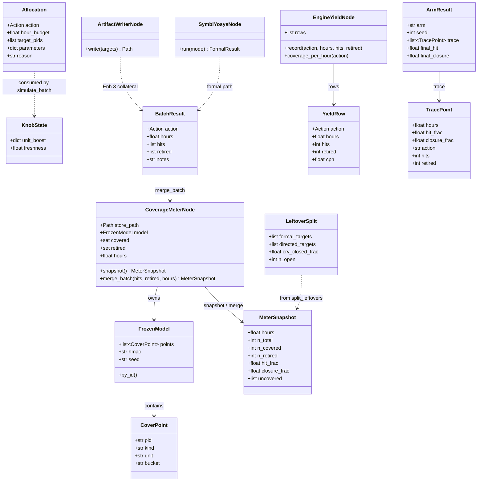

# Class diagram

Appendix: planner-visible types and CHIA nodes.  
**Submission story:** [SUBMIT.md](../SUBMIT.md). Leftover-split narrative:
[ARCHITECTURE.md](Verification%20ChiaLoop%20Architecture%20Overview.md).

MediumBOOM entry: `experiments/coverage_growth/run_legacy_experiment.py --backend boom` → `loop.py` →
`boom_backend.py` / `enhancement.py` → `CoverageMeterNode`.

## Mermaid (classes)



## Loop collaboration

```mermaid
sequenceDiagram
    participant Driver as run_experiment --backend boom
    participant Meter as CoverageMeterNode
    participant Plan as enhancement_plan
    participant Yield as EngineYieldNode
    participant Boom as boom_backend
    participant SBY as formal / soc_formal

    Driver->>Meter: snapshot
    Meter-->>Driver: MeterSnapshot (open names only)
    Driver->>Plan: plan(snap, yields, remaining)
    Plan-->>Driver: Allocation
    alt action == formal
        Driver->>SBY: cover BMC (LSU; ChipTop may fall back)
        SBY-->>Boom: hits + retired
    else torture / riscv_dv / directed
        Driver->>Boom: SoC ELF + PASS credits
        Boom-->>Driver: hits (no retire)
    end
    Driver->>Meter: merge_batch(hits, retired, hours)
    Driver->>Yield: record(...)
```

## Module → type ownership

| Type | Defined in |
|------|------------|
| `CoverPoint`, `FrozenModel` | `coverage_model.py` |
| `CoverageMeterNode`, `MeterSnapshot` | `meter.py` |
| `Allocation`, `BatchResult`, `KnobState` | `engines.py` |
| `EngineYieldNode`, `YieldRow`, `Action` | `yield_table.py` |
| `LeftoverSplit` | `prune.py` |
| `TracePoint`, `ArmResult` | `loop.py` |
| `SymbiYosysNode` | `nodes/symbiyosys.py` |
| `ArtifactWriterNode` | `nodes/artifact_writer.py` |

## Resource slots (`@ChiaFunction`)

| Resource | Typical borrower |
|----------|------------------|
| `coverage_meter: 1` | snapshot / merge_batch |
| `torture: 1` | SoC CRV carpet |
| `riscv_dv` + `verilator_run` | CRV generate + score |
| `formal: 1` | `chia_run_formal` |
| `artifact_writer: 1` | `chia_write_artifact` (Enh 3) |
| `verilator_run: 1` | directed / SoC score |

Cluster advertisement: `experiments/coverage_growth/cluster.yaml`.
