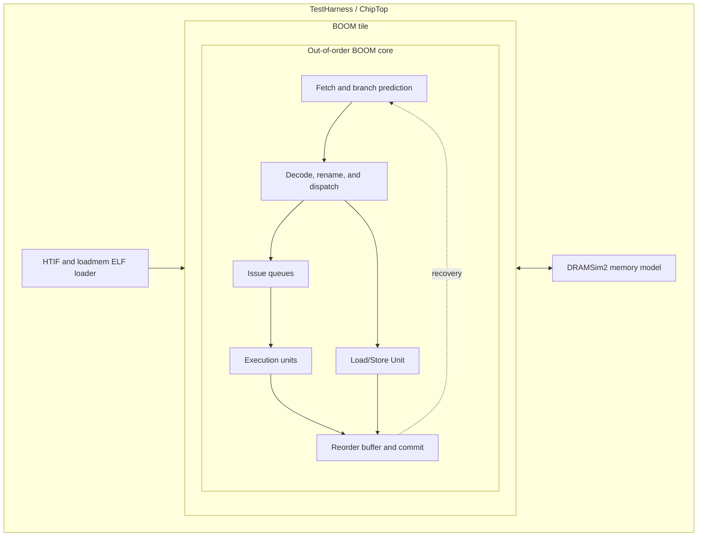

# MediumBOOM Overview

> Historical experiment description. For the new semantic assertions, coverage
> definitions and audit of the proxy model, see
> [BOOM last-mile verification](BOOM_LAST_MILE_VERIFICATION.md). The historical
> bounded-cover retirement described below is no longer accepted as a proof.

## 1. MediumBOOM Overview

This project exercises a generated [Chipyard](https://github.com/ucb-bar/chipyard) SoC configured as `MediumBoomV3Config`. The CPU is [BOOM](https://github.com/riscv-boom/riscv-boom), an out-of-order RISC-V core. The test flow combines SoC simulation and formal cover checking.

`MediumBoomV3Config` is a standard upstream Chipyard configuration class. It instantiates one medium BOOM v3 tile ([Chipyard source](https://github.com/ucb-bar/chipyard/blob/main/generators/chipyard/src/main/scala/config/BoomConfigs.scala)).
“V3” identifies BOOM’s v3 configuration family; the medium definition is
2-wide ([BOOM config source](https://github.com/riscv-boom/riscv-boom/blob/master/src/main/scala/v3/common/config-mixins.scala)).

`MediumBoomV3Config` builds a Chipyard `TestHarness` containing a BOOM tile/core plus SoC infrastructure such as memory interfaces, HTIF/loadmem, and the DRAM model. The generated executable is the complete SoC simulator.

The project does not modify BOOM RTL. Its design-specific code locates the generated modules and attaches simulation/formal infrastructure to them.

The reported yardstick is frozen at 51 points: 43 SoC simulation bins and 8 named SVA cover points. It is not UCIS or Verilator line coverage.

### 1.1 Block Diagram

This is a high-level block diagram.  BOOM Core has frontend, rename/dispatch, reorder-buffer, commit, execution logic, issue queues, branch prediction, and LSU blocks. ChipTop` integrates the BOOM tile with SoC-level memory and peripheral interfaces. HTIF loads a compiled RISC-V ELF into the simulated system, while DRAMSim2 supplies the backing-memory behavior seen during execution.

### 1.2 Configuration

| Area | Configuration |
|---|---|
| SoC | Chipyard `MediumBoomV3Config`, a standard upstream configuration ([Chipyard source](https://github.com/ucb-bar/chipyard/blob/main/generators/chipyard/src/main/scala/config/BoomConfigs.scala)) |
| CPU | BOOM medium-v3, 2-wide configuration ([BOOM config source](https://github.com/riscv-boom/riscv-boom/blob/master/src/main/scala/v3/common/config-mixins.scala)) |
| RTL generation | Chisel -> CIRCT `firtool` -> split Verilog |
| Simulation | Verilator SoC executable, ELF loaded with `+loadmem` |
| CRV stimulus | [riscv-torture](https://github.com/ucb-bar/riscv-torture); 200 sequences/test; 65% ALU, 20% branch, 15% memory |
| Formal | [SymbiYosys](https://symbiyosys.readthedocs.io/), Yosys, Z3 |
| Coverage mode | `VM_COVERAGE=0`; no Verilator line/toggle coverage data. This project scores custom SoC program/pass/cycle bins instead. |

(The alternative is to rebuild the simulator with `VM_COVERAGE=1`. That would instrument the generated RTL and produce Verilator coverage data for merging and reporting, but it was not done for this run because the rebuild is slow.)

The CRV settings are in
[`../adapters/mediumboom/stimulus/mediumboom.config`](../adapters/mediumboom/stimulus/mediumboom.config).
The memory-heavy directed variant is
[`../adapters/mediumboom/stimulus/mediumboom_directed.config`](../adapters/mediumboom/stimulus/mediumboom_directed.config).

### 1.3 Chipyard Generation Flow

**Inputs:** the upstream Chipyard and BOOM source trees, the selected
`MediumBoomV3Config`, and the local build settings in
[`../adapters/mediumboom/scripts/setup_mediumboom.sh`](../adapters/mediumboom/scripts/setup_mediumboom.sh).

**Outputs:** generated SystemVerilog collateral and a native executable that
simulates the complete MediumBOOM SoC. The executable later runs RISC-V ELF programs during the CRV flow.

[`../adapters/mediumboom/scripts/setup_mediumboom.sh`](../adapters/mediumboom/scripts/setup_mediumboom.sh) performs this
flow. The checked-in build evidence is
[`../artifacts_mediumboom/verilator_build.log`](../artifacts_mediumboom/verilator_build.log).
The upstream Chipyard/BOOM source and generated Verilog are build inputs and outputs, not committed as a local RTL snapshot in this repository.

The executable's full filename is
`simulator-chipyard.harness-MediumBoomV3Config`. Chipyard derives it from the
model package (`chipyard.harness`) and selected configuration
(`MediumBoomV3Config`); the diagram uses the shorter name because the filename
does not describe its purpose as clearly.

## 2. Design corpus

The design corpus is the source and generated implementation of the DUT.

| Corpus item | Provenance | Role in this project |
|---|---|---|
| Chipyard platform | Upstream: [ucb-bar/chipyard](https://github.com/ucb-bar/chipyard) | Elaborates the SoC and TestHarness. |
| BOOM CPU | Upstream: [riscv-boom/riscv-boom](https://github.com/riscv-boom/riscv-boom) | Supplies the out-of-order core, LSU, issue queues, and branch predictor. |
| `MediumBoomV3Config` selection | Upstream standard config; selected by our [`../adapters/mediumboom/scripts/setup_mediumboom.sh`](../adapters/mediumboom/scripts/setup_mediumboom.sh) | Selects the exact Chipyard configuration to elaborate. |
| Generated RTL | Generated locally by Chipyard/CIRCT during our build | RTL used by simulation and formal wrapper discovery. |
| Verilator simulator | Generated locally by Verilator during our build | Executes RISC-V ELF programs against the complete SoC. |
| Formal DUT adapters | Written in this project: [`../adapters/mediumboom/soc_formal.py`](../adapters/mediumboom/soc_formal.py), [`../adapters/mediumboom/lsu_driver.py`](../adapters/mediumboom/lsu_driver.py) | Select generated scopes, stub external interfaces, and write legal wrappers. |

## 3. Verification Corpus

### 3.1 Stimulus corpus: random and directed RISC-V programs

[`../adapters/mediumboom/scripts/generate_riscv_torture.sh`](../adapters/mediumboom/scripts/generate_riscv_torture.sh)
uses the two project configs to generate RISC-V assembly, compile ELF files,and emit disassemblies and generator statistics.

This script is invoked separately after setup_mediumboom.sh
It uses Chipyard’s tools/torture plus a RISC-V cross-compiler to produce the .S, .elf, .dump, and .stats stimulus corpus.

The generated corpus is under
[`../artifacts_mediumboom/riscv_torture/`](../artifacts_mediumboom/riscv_torture/):

- `mediumboom_*.S`: balanced constrained-random programs.
- `mediumboom_dir_*.S`: memory-heavy directed programs.
- Matching `.elf`, `.dump`, and `.stats` files.
- [`manifest.json`](../artifacts_mediumboom/riscv_torture/manifest.json): program
  inventory and compiler outcome. The recorded run has 12 successful compiles  and 0 failures.

### 3.2 Coverage corpus: frozen 51-point model

[`frozen_coverage_model.json`](../artifacts_mediumboom/real_enhancements_fixed/frozen_coverage_model.json)
is the authoritative, HMAC-sealed coverage list. The meter will only merge
known point IDs, and it rechecks the HMAC before a merge.

| Point type | Count | Evidence source |
|---|---:|---|
| Opcode bins | 31 | Passing SoC program mix |
| Branch bins | 2 | Passing SoC program mix |
| SoC class bins | 6 | Passing SoC program mix |
| Pass/cycle bins | 4 | Verilator output log |
| SVA cover points | 8 | Formal cover run |

Meter ownership and merge rules are in
[`../adapters/mediumboom/meter.py`](../adapters/mediumboom/meter.py). The point model
is created and sealed by
[`../adapters/mediumboom/coverage_model.py`](../adapters/mediumboom/coverage_model.py).

### 3.3 Formal corpus: SVA covers and generated wrappers

`SVA_SPEC` in [`../adapters/mediumboom/boom_backend.py`](../adapters/mediumboom/boom_backend.py)
is project authored file. it defines eight LSU-related cover targets. Six are reachable events; two (`contra` and `never`) are intentionally unreachable.

The formal corpus contains:

- The cover specification in `SVA_SPEC`.
- Generated SystemVerilog wrappers from
  [`../adapters/mediumboom/lsu_driver.py`](../adapters/mediumboom/lsu_driver.py).
- ChipTop/tile scope generation and fallback logic in
  [`../adapters/mediumboom/soc_formal.py`](../adapters/mediumboom/soc_formal.py).
- The CHIA formal node in
  [`../adapters/mediumboom/nodes/symbiyosys.py`](../adapters/mediumboom/nodes/symbiyosys.py).
- Corrected solver evidence in
  [`../artifacts_mediumboom/formal_wrapper_fix/NOTES.md`](../artifacts_mediumboom/formal_wrapper_fix/NOTES.md).

The corrected run reached six SVA covers and retired the two intentionally unreachable covers. A cover-mode `FAIL` here means an intended cover remained unreached; it is not a tool elaboration failure.

### 3.4 Execution corpus: simulation logs, policy, and measured results

[`../adapters/mediumboom/boom_backend.py`](../adapters/mediumboom/boom_backend.py)
loads each ELF with `+loadmem`, detects `*** PASSED ***`, extracts cycle counts,
and credits SoC bins. It does not claim commit-log coverage, UCIS, or
`VM_COVERAGE` results.

The corrected run output is
[`../artifacts_mediumboom/real_enhancements_fixed/`](../artifacts_mediumboom/real_enhancements_fixed/):

| Artifact | Purpose |
|---|---|
| [`results.json`](../artifacts_mediumboom/real_enhancements_fixed/results.json) | Per-arm trace and final hit/closure results. |
| [`policy.json`](../artifacts_mediumboom/real_enhancements_fixed/policy.json) | Engine allocation by arm. |
| [`coverage_vs_hours.svg`](../artifacts_mediumboom/real_enhancements_fixed/coverage_vs_hours.svg) | Coverage progression. |
| [`final_coverage_bars.svg`](../artifacts_mediumboom/real_enhancements_fixed/final_coverage_bars.svg) | Final hit versus closure. |

The top-level [`../artifacts_mediumboom/results.json`](../artifacts_mediumboom/results.json)
is an older, non-comparable freeze. See
[`../artifacts_mediumboom/DO_NOT_CITE_OLD_RESULTS.md`](../artifacts_mediumboom/DO_NOT_CITE_OLD_RESULTS.md).
