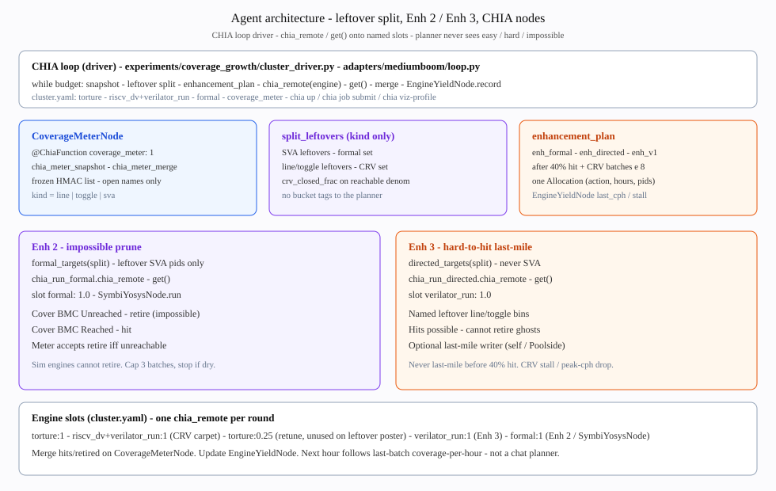

# Agent architecture — impossible prune and hard-to-hit leftovers

The planner does **not** see easy / hard / impossible. It sees open names
(`id`, `kind`, `unit`) from `CoverageMeterNode`. Kind splits leftovers.
Formal discovers impossibility. Directed snipes hard-to-hit **non-SVA** bins.
Every batch is a CHIA node: `@ChiaFunction` then `chia_remote` / `get()`.



## CHIA loop (driver)

Same shape as `chia/examples/memcpy`: the driver only **plans** and **places**.

```
chia up experiments/coverage_growth/cluster.yaml
chia job submit -- python experiments/coverage_growth/cluster_driver.py
chia viz-profile   # sim-CPU-hours, same currency as solver hours
```

Local (no Docker workers): `adapters/mediumboom/loop.py` still calls
`adapters/mediumboom/chia_dispatch.py`. Without `chialoops`,
`src/chialoop/compat.py`
implements `chia_remote` in-process — a supported local-driver mode.

Each round:

1. `chia_meter_snapshot` → slot `coverage_meter: 1`
2. `split_leftovers(snap)` — SVA vs line/toggle (`prune.py`)
3. `enhancement_plan` → one `Allocation` (Enh 2, Enh 3, or both)
4. `ENGINE_NODES[action].chia_remote(...)` → `get()`
5. `chia_meter_merge` → HMAC check; only legal mutation
6. `EngineYieldNode.record` — coverage-per-hour for the next round

## How the agent finds impossibles (Enh 2)

| Step | What happens |
|------|----------------|
| Split | Planner-visible leftover with `kind == sva` → `formal_targets` |
| Gate | `hit_frac >= 0.40` and `riscv_dv` batches ≥ 8 (do not steal hours-to-40%) |
| Place | `chia_run_formal` onto **`formal: 1.0`** |
| DUT | `SymbiYosysNode.run` — cover Bounded Model Checking |
| Unreached | Meter **retires** if the frozen point is unreachable |
| Reached | Meter **hits** |
| Cap | Three useful batches; stop if dry (0 hits and 0 retired) |

Directed **cannot** retire. Baseline never calls this node, so it chases ghosts.

## How the agent finds hard-to-hit leftovers (Enh 3)

| Step | What happens |
|------|----------------|
| Split | Leftover `kind != sva` → `directed_targets` (never SVA pids) |
| Gate | Same 40% hit bar, plus CRV stall / peak coverage-per-hour drop / 16 batches |
| Write | `chia_write_artifact` onto **`artifact_writer: 1.0`** — LLM (Astra/Poolside) or self suite |
| Place | `chia_run_directed` onto **`verilator_run: 1.0`** — scores the written `.S` |
| Score | Hits merge; Unreached is **not** a directed outcome |

Collateral construction and scoring are **two CHIA nodes**. Generate ≠ score.

## Node map

| Node / function | Slot | Role |
|-----------------|------|------|
| `CoverageMeterNode` / `chia_meter_snapshot` / `chia_meter_merge` | `coverage_meter: 1` | Frozen list; planner-blind view |
| `EngineYieldNode` | driver | Coverage-per-hour table (not a DUT) |
| `chia_run_torture` | `torture: 1` | Early carpet |
| `chia_run_riscv_dv` | `riscv_dv: 1` + `verilator_run: 1` | Constrained-random carpet |
| `chia_run_constraint_tuning` | `torture: 0.25` | Unused on leftover poster |
| `chia_write_artifact` / `ArtifactWriterNode` | `artifact_writer: 1` | **LLM / self last-mile assembly** |
| `chia_run_directed` | `verilator_run: 1` | Enh 3 score of written collateral |
| `chia_run_formal` / `SymbiYosysNode` | `formal: 1` | Enh 2 impossible prune |

Code: `adapters/mediumboom/chia_dispatch.py`, `adapters/mediumboom/nodes/artifact_writer.py`,
`experiments/coverage_growth/cluster_nodes.py`,
`experiments/coverage_growth/cluster_driver.py`, `experiments/coverage_growth/cluster.yaml`.
