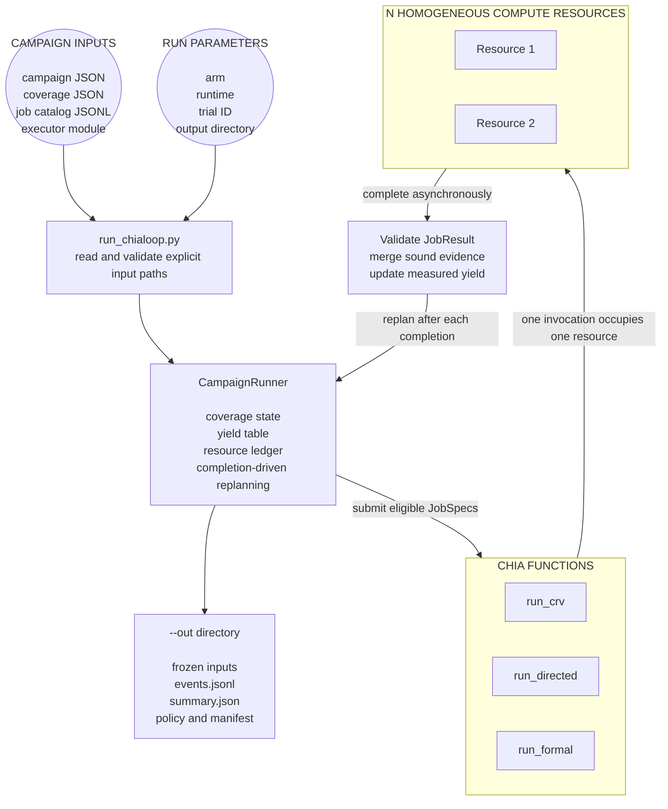

# Verification Chialoop Implementation Overview

## 1. Scope

This document describes the artifact-agnostic Chialoop implemented under
`src/chialoop/` and invoked by `run_chialoop.py`.

The implementation runs one frozen verification campaign using either:

- `adaptive`: choose work from measured sound-coverage gain per compute-hour; or
- `static`: follow the frozen Static-Hybrid manifest.

Both arms use the same asynchronous dispatcher, CHIA functions, resources,
coverage validator, job catalog, and stopping rules. The core does not generate
MediumBOOM RTL, tests, programs, or formal properties. An injected executor runs
those already-prepared artifacts and returns evidence.

## 2. Where the implementation lives

| File | Responsibility |
| --- | --- |
| [`run_chialoop.py`](../run_chialoop.py) | Command-line entry point. Reads input paths, selects the arm and runtime, runs a campaign, or compares completed runs. |
| [`src/chialoop/orchestration/driver.py`](../src/chialoop/orchestration/driver.py) | The actual closed loop. Dispatches work, waits for asynchronous completions, merges evidence, updates yield, and replans. |
| [`src/chialoop/orchestration/nodes.py`](../src/chialoop/orchestration/nodes.py) | Defines the three CHIA functions: `run_crv`, `run_directed`, and `run_formal`. |
| [`src/chialoop/orchestration/runtime.py`](../src/chialoop/orchestration/runtime.py) | Implements real CHIA dispatch and the process-isolated local fallback. |
| [`src/chialoop/orchestration/policies.py`](../src/chialoop/orchestration/policies.py) | Adaptive and Static-Hybrid job-selection policies. |
| [`src/chialoop/core/resources.py`](../src/chialoop/core/resources.py) | Authoritative local admission ledger for compute and license tokens. |
| [`src/chialoop/core/coverage.py`](../src/chialoop/core/coverage.py) | Sound-coverage state and evidence validation. |
| [`src/chialoop/core/yields.py`](../src/chialoop/core/yields.py) | Per-`(engine, partition)` measured coverage yield. |
| [`src/chialoop/core/catalog.py`](../src/chialoop/core/catalog.py) | Frozen job catalog, lane ordering, and Static-Hybrid manifest construction. |
| [`src/chialoop/core/config.py`](../src/chialoop/core/config.py) | Frozen campaign configuration. |
| [`src/chialoop/core/types.py`](../src/chialoop/core/types.py) | Shared records such as `JobSpec`, `EngineEvidence`, and `JobResult`. |
| [`src/chialoop/reporting/events.py`](../src/chialoop/reporting/events.py) | JSONL event logging. |
| [`src/chialoop/reporting/comparison.py`](../src/chialoop/reporting/comparison.py) | Paired-run validation, ROI statistics, Markdown report, and SVG generation. |

## 3. Input-to-output flow



The controller may have two jobs running at once. Completion order does not
need to match dispatch order. The controller waits for the first completion,
updates the authoritative state, and immediately chooses the next eligible job.

## 4. Where inputs are picked from

There are no hard-coded input directories. Every run input is named explicitly
on the command line.

The repository's recommended locations are
`experiments/coverage_growth/configs/`, `coverage/`, and `catalogs/`. An
executor remains an importable adapter callable, normally under
`adapters/<dut>/`.

```text
python run_chialoop.py run \
  --campaign <path-to-campaign.json> \
  --coverage <path-to-coverage.json> \
  --catalog <path-to-job-catalog.jsonl> \
  --executor <python.module:callable> \
  --arm adaptive|static \
  --runtime chia|local \
  --trial-id <paired-trial-id> \
  --out <run-output-directory>
```

### 4.1 Campaign configuration: `--campaign`

Loaded by `CampaignSpec.read_json()` from exactly the path passed to
`--campaign`.

Example:

```json
{
  "campaign_id": "boom-core-v1",
  "artifact_version": "mediumboom-rtl-sha256",
  "assumption_version": "formal-assumptions-v1",
  "target_closure": 0.95,
  "budget_compute_hours": 100.0,
  "resources": {
    "compute": 2,
    "sim_license": 1,
    "formal_license": 1
  },
  "recent_window": 3,
  "exploration_period": 10,
  "max_in_flight_per_lane": 1
}
```

The core experiment expects two interchangeable compute slots, one simulation
license, and one formal license unless the supplied campaign file says
otherwise.

### 4.2 Coverage registry: `--coverage`

Loaded from exactly the path passed to `--coverage`. The JSON may be a list or
an object containing a `points` list.

```json
{
  "points": [
    {"point_id": "frontend.cp01", "partition_id": "frontend"},
    {"point_id": "decode.cp01", "partition_id": "decode"},
    {"point_id": "execute.cp01", "partition_id": "execute"},
    {"point_id": "lsu.cp01", "partition_id": "lsu"},
    {"point_id": "commit.cp01", "partition_id": "commit"}
  ]
}
```

The current core requires exactly five distinct coverage partitions. Coverage
starts empty. A point closes only through an accepted hit or a complete formal
proof of unreachability.

### 4.3 Frozen job catalog: `--catalog`

Loaded by `JobCatalog.read_jsonl()` from exactly the path passed to `--catalog`.
Each line is one `JobSpec`.

```json
{"job_id":"crv-frontend-0001","engine":"crv","partition_id":"frontend","sequence_in_lane":0,"target_point_ids":["frontend.cp01"],"seed_or_query_id":"seed-0001","timeout_seconds":900,"artifact_version":"mediumboom-rtl-sha256","assumption_version":null,"resources":{"compute":1,"sim_license":1,"formal_license":0},"payload":{"program":"prepared/crv/seed-0001.elf"}}
```

The `payload` is opaque to the controller. It may contain paths or identifiers
for prepared ELF files, simulators, formal properties, work directories, or
tool options. The executor interprets it.

Both arms must receive the same catalog for a paired trial. Lane order is
defined by `(partition_id, engine, sequence_in_lane, job_id)`.

### 4.4 Engine executor: `--executor`

`--executor` is an importable Python callable in
`package.module:callable` form. It receives a `JobSpec`, runs the external tool,
and returns `EngineEvidence`.

```python
from chialoop import EngineEvidence, JobSpec


def execute(job: JobSpec) -> EngineEvidence:
    # Resolve prepared artifacts from job.payload and run the selected tool.
    return EngineEvidence(
        hit_point_ids=("frontend.cp01",),
        artifact_version="mediumboom-rtl-sha256",
        artifact_paths=("results/crv-frontend-0001/coverage.json",),
        tool_versions={"verilator": "5.x"},
    )
```

Coverage-bearing evidence must report the actual `artifact_version`. Formal
coverage evidence must additionally report the actual `assumption_version` and
a consistent `proof_status`. Missing or mismatched provenance is rejected.

### 4.5 Run parameters

| CLI option | Meaning |
| --- | --- |
| `--arm adaptive` | Use recent sound points per compute-hour, initial probes, and periodic exploration. |
| `--arm static` | Use the frozen 4-CRV, 1-directed, 1-formal manifest. |
| `--runtime chia` | Invoke the decorated functions with `chia_remote`. This is the default. |
| `--runtime local` | Use isolated local worker processes with the same asynchronous controller semantics. |
| `--trial-id` | Pairing key. The static and adaptive summaries being compared must have the same trial ID. |
| `--out` | Directory into which the run writes all recorded outputs. |

## 5. CHIA node definitions

The nodes are defined in
[`src/chialoop/orchestration/nodes.py`](../src/chialoop/orchestration/nodes.py).

```python
@ChiaFunction(resources={"compute": 1, "sim_license": 1})
def run_crv(job, executor, start_notifier=None): ...

@ChiaFunction(resources={"compute": 1, "sim_license": 1})
def run_directed(job, executor, start_notifier=None): ...

@ChiaFunction(resources={"compute": 1, "formal_license": 1})
def run_formal(job, executor, start_notifier=None): ...
```

Each invocation consumes one homogeneous compute resource. CRV and directed
jobs share the single simulation-license token. Formal uses the separate
formal-license token. With two compute resources, one simulation and one formal
job may overlap; two simulation jobs may not.

The common node body:

1. records the actual worker start time;
2. calls the injected executor;
3. converts executor exceptions into error results;
4. discards evidence returned after the job timeout;
5. returns measured compute time, evidence, artifacts, tool versions, and
   provenance in a `JobResult`.

## 6. The actual Chialoop

`CampaignRunner.run()` in
[`src/chialoop/orchestration/driver.py`](../src/chialoop/orchestration/driver.py)
implements the loop:

```text
check target and compute budget
    -> find pending jobs that fit free compute and license tokens
    -> ask the selected policy for the next job
    -> submit it asynchronously
    -> continue dispatching while compatible capacity remains
    -> wait for the first completion or deadline
    -> validate and merge the result
    -> update per-lane yield
    -> repeat
```

The loop stops when it reaches target closure, exhausts the compute budget,
exhausts the catalog, or has no schedulable job. Remaining jobs are cancelled
and their consumed compute is recorded.

### 6.1 Adaptive selection

`AdaptivePolicy` first probes each non-empty `(engine, partition)` lane. It then
selects the eligible lane with the highest recent:

```text
new sound points / compute-hours
```

Every tenth dispatch, by default, explores the least-sampled eligible lane.
Tie-breaking is deterministic.

### 6.2 Static-Hybrid selection

`StaticHybridPolicy` follows a manifest constructed before execution:

1. four CRV passes across partitions;
2. one directed pass across partitions;
3. one formal pass across eligible partitions;
4. repeat until the catalog is consumed.

If the next manifest job cannot use the currently free licenses, the policy
scans forward to the first pending job that fits.

### 6.3 Evidence acceptance

`CoverageState` rejects a result when any of the following is true:

- job ID or engine does not match the dispatched job;
- coverage evidence comes from a non-success result;
- artifact provenance does not match the frozen campaign;
- returned evidence is outside the job's declared target points;
- simulation claims formal unreachability;
- formal proof status is incomplete or inconsistent;
- formal assumptions do not match the frozen campaign; or
- returned coverage point IDs do not exist in the registry.

Only accepted evidence changes sound closure. Rejected work still consumes
compute-hours.

## 7. Where run outputs are placed

All persistent run outputs go under the directory passed to `--out`.

For an adaptive run such as:

```text
--out runs/trial-01/adaptive
```

the implementation writes:

```text
runs/trial-01/adaptive/
├── campaign_spec.json
├── job_catalog.jsonl
├── policy.json
├── events.jsonl
└── summary.json
```

For a static run, it also writes:

```text
runs/trial-01/static/static_manifest.json
```

| Output | Contents |
| --- | --- |
| `campaign_spec.json` | Normalized copy of the frozen campaign supplied through `--campaign`. |
| `job_catalog.jsonl` | Normalized copy of the frozen catalog supplied through `--catalog`. |
| `policy.json` | Policy name and frozen parameters; includes the manifest for the static arm. |
| `static_manifest.json` | Ordered static job IDs. Written only for the static arm. |
| `events.jsonl` | Ordered campaign, dispatch, completion, timeout, cancellation, target, and final-summary events. |
| `summary.json` | Final coverage, `Compute95`, `T95`, compute by engine, license time, utilization, zero-yield work, status counts, coverage trace, resource timeline, and campaign fingerprint. |

The same final summary is also printed to standard output.

## 8. Paired comparison inputs and outputs

Comparison takes completed `summary.json` files as explicit inputs:

```text
python run_chialoop.py compare \
  --static-summary runs/trial-01/static/summary.json \
  --adaptive-summary runs/trial-01/adaptive/summary.json \
  --out runs/comparison
```

Repeat `--static-summary` and `--adaptive-summary` for additional paired trials.

Before calculating ROI, the comparator verifies:

- identical trial-ID sets;
- no duplicate trial IDs;
- correct static and adaptive arm labels;
- matching campaign fingerprints within each pair; and
- matching runtime types within each pair.

The comparison output directory contains:

```text
runs/comparison/
├── comparison.json
├── comparison.md
├── coverage_vs_compute_hours.svg
└── resource_timeline.svg
```

`comparison.json` contains the paired statistics. `comparison.md` contains the
short result statement. The two SVG files show sound closure versus occupied
compute-hours and asynchronous resource occupancy.

If both arms reach target in every pair, the primary result is:

```text
median across pairs of:
    1 - Compute95(adaptive) / Compute95(static)
```

If either arm misses the target, the comparator does not report a Compute95
speedup. It reports final closure under the same configured budget instead.

## 9. Current integration boundary

The core is executable only when the four external inputs are supplied:
campaign JSON, coverage JSON, job catalog JSONL, and an importable executor.
The repository does not currently provide a registered MediumBOOM adapter that
converts the older `artifacts*/frozen_coverage_model.json` files into this new
five-partition input contract. Those older artifacts are therefore not read
automatically by `run_chialoop.py`.

This boundary is deliberate: the loop, scheduling, evidence validation, and ROI
measurement are implemented independently from MediumBOOM artifact generation.

## 10. Verification

The implementation tests are:

- [`tests/chialoop/test_core.py`](../tests/chialoop/test_core.py)
- [`tests/chialoop/test_driver.py`](../tests/chialoop/test_driver.py)

They cover resource admission, manifest order, adaptive selection, evidence
soundness, artifact and assumption provenance, asynchronous completion,
deadline cancellation, campaign fingerprint matching, output generation, and
paired comparison.

The implementation has also been smoke-tested against the vendored CHIA/Ray
runtime, including asynchronous completion, execution-start accounting, and
force cancellation without requiring the Ray dashboard.
